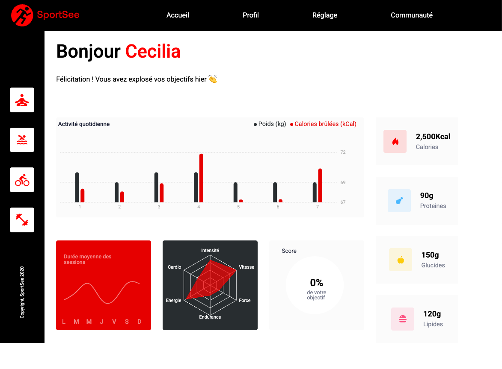

# SportSee - Sports Analytics Dashboard



## Overview

**SportSee** is an interactive sports coaching analytics dashboard built with React. This project visualizes user fitness data through advanced charts and diagrams, providing a comprehensive view of athletic performance and progress.

📊 **Key Features:**

- **User Profile Dashboard:** Detailed visualization of user's sports activities
- **Interactive Charts:** Dynamic data representation using Recharts
- **Data Integration:** Complete API integration with a Node.js backend
- **Responsive Design:** Optimized for various screen sizes
- **Comprehensive Documentation:** Includes JSDoc and PropTypes

---

## ✨ Features

- **Performance Analytics:**

  - Daily activity tracking and visualization
  - Detailed session duration analysis
  - Performance metrics across different activity types
  - Nutrition tracking (calories, proteins, carbs, fats)

- **Interactive Dashboard:**

  - Real-time data visualization
  - Multiple chart types (bar charts, line charts, radar charts, radial charts)
  - Intuitive user interface
  - Tooltip information on hover

- **User Profiles:**
  - Individual user data retrieval
  - Personalized statistics and insights
  - Historical data comparison

---

## 🛠 Built With

- **React** - Frontend framework
- **React Router DOM** - Navigation management
- **Recharts** - Data visualization library
- **Fetch API** - HTTP requests handling
- **CSS** - Styling
- **PropTypes** - Type checking
- **JSDoc** - Code documentation

---

## 📦 Installation

Follow these steps to set up the project locally:

1. **Clone the repository**

   ```bash
   git clone https://github.com/yourusername/sportsee.git
   cd sportsee
   ```

2. **Install dependencies**

   ```bash
   npm install
   ```

3. **Set up the backend**

   ```bash
   git clone https://github.com/OpenClassrooms-Student-Center/SportSee.git backend
   cd backend
   yarn
   ```

4. **Start the backend server**

   ```bash
   yarn dev
   ```

5. **Start the frontend development server**

   ```bash
   cd ..
   npm start
   ```

The application should now be running on `http://localhost:3000` with the backend API available on `http://localhost:3001`.

---

## 🔄 API Integration

The application fetches data from a Node.js backend API with the following endpoints:

- `GET /user/${userId}` - Retrieves user information
- `GET /user/${userId}/activity` - Retrieves user activity data
- `GET /user/${userId}/average-sessions` - Retrieves average session data
- `GET /user/${userId}/performance` - Retrieves performance data

Sample users available: 12 and 18

---

## 📊 Charts Implementation

This project uses Recharts to implement various visualization components:

- **Bar Chart:** Displays daily activity (weight and calories)
- **Line Chart:** Shows average session duration
- **Radar Chart:** Visualizes performance across different activity types
- **Radial Bar Chart:** Represents achievement of daily goals

---

## 📝 Documentation

This project includes:

- **JSDoc:** Comprehensive documentation for all components and functions
- **PropTypes:** Type checking for all component props
- **README:** Detailed project information and setup instructions

To generate the documentation:

```bash
npm run docs
```

---

## 📁 Project Structure

```
src/
├── components/        # Reusable UI components
├── pages/             # Application pages
├── services/          # API calls and data handling
├── utils/             # Helper functions
├── assets/            # Static assets
├── models/            # Data models
└── App.js             # Main application component
```

---

## 🤝 Contributing

Contributions are welcome! Please feel free to submit a Pull Request.

1. Fork the Project
2. Create your Feature Branch (`git checkout -b feature/AmazingFeature`)
3. Commit your Changes (`git commit -m 'Add some AmazingFeature'`)
4. Push to the Branch (`git push origin feature/AmazingFeature`)
5. Open a Pull Request

---

## 👨‍💻 Author

- 🌐 **Portfolio** - [Julien Gilbert](https://juliengilbert.com/)
- 🏆 **GitHub** - [@juliengDev](https://github.com/juliengDev)
- 💼 **LinkedIn** - [Julien Gilbert](https://www.linkedin.com/in/julien-gilbert-reactjs/)

---

🎯 _This project was completed as part of the Front-End Developer path at OpenClassrooms._
